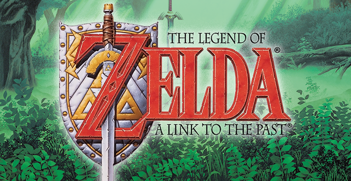

# _The Legend of Zelda: A Link to the Past_ Resource Pack for Solarus

This repository provides musics, sounds, tilesets, sprites and scripts from the 1992 Super Nintendo game [_The Legend of Zelda: A Link to the Past_](https://en.wikipedia.org/wiki/The_Legend_of_Zelda:_A_Link_to_the_Past),
adapted for [Solarus](https://www.solarus-games.org), a free and open-source game engine.

## Goal

The goal of this resource pack is also to provide at least all [data files required by Solarus](https://gitlab.com/solarus-games/solarus/blob/master/work/data_files.txt), in order to help people develop a game using ALTTP graphics.

Since _A Link to the Past_ is huge, there will always be missing or incomplete elements. Feel free to contribute!

Also, there may be unwanted elements, typically, resources that don't come from ALTTP but that were created for _Mystery of Solarus DX_ and ended up here. If you find such inconsistencies, please report them by opening an issue.

## Branches

Branch `master` always points to the latest release of this resource pack.

The latest resource pack release is always compatible with the latest Solarus version.

Resources compatible with older versions or development versions of Solarus live in their own branches.

## How to use

### Create a new quest with ALTTP resources

Using the ALTTP resource pack for a new quest is straightforward. The idea is to create your quest as a copy of the ALTTP resource pack rather than creating it from the quest editor:

1. Create a new empty folder for your quest.
2. Copy the `data` folder of the ALTTP resource pack and all its content into your quest's folder.
3. Open your new quest with Solarus Quest Editor.
4. Edit the quest properties (<kbd>Ctrl</kbd>+<kbd>P</kbd>) to set a title, a write directory and other information of your game.

### Integrate ALTTP resources into an existing quest

This might be quite tedious if your quest already has resources with the same id as resources of this pack. In future versions of Solarus Quest Editor, an import feature will make the process easier.

Here is how to proceed:

1. Make a backup of your quest.
2. Copy the content of this repository's `data` directory into the `data` directory of your quest, except `project_db.dat` and `quest.dat`. If you don't want the whole pack but only a few sprites, tilesets or sounds, you can also only pick the resources you need.

   **Note:** The file `project_db.dat` is the list of resources of your quest and you don't want to lose the existing ones. `quest.dat` are the properties of your quest like the title and the savegames directory.

3. Open your quest with Solarus Quest Editor.
4. In the quest tree, all resources you just copied now appear with an interrogation mark icon.
5. You can right-click them to add them to the quest.

## License

This resource pack is licensed under multiple licenses:

- Graphics, sounds, names: Proprietary, copyrighted by [Nintendo](https://www.nintendo.com/).
- Lua scripts: [GNU General Public License v3.0](https://www.gnu.org/licenses/gpl-3.0.en.html).
- Data files: [Creative Commons Attribution-ShareAlike 4.0 International](https://creativecommons.org/licenses/by-sa/4.0/).
